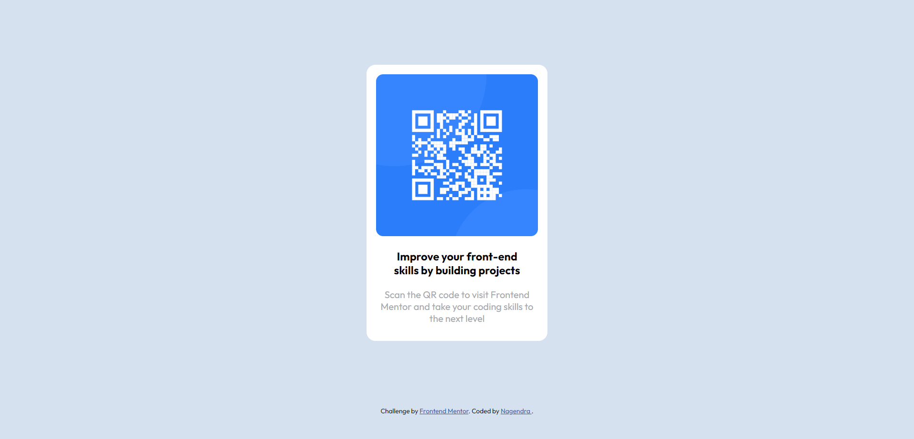

# Frontend Mentor - QR code component solution

This is a solution to the [QR code component challenge on Frontend Mentor](https://www.frontendmentor.io/challenges/qr-code-component-iux_sIO_H). Frontend Mentor challenges help you improve your coding skills by building realistic projects. 

## Table of contents

- [Frontend Mentor - QR code component solution](#frontend-mentor---qr-code-component-solution)
  - [Table of contents](#table-of-contents)
  - [Overview](#overview)
    - [Screenshot](#screenshot)
    - [Links](#links)
    - [Built with](#built-with)
    - [What I learned](#what-i-learned)
    - [Useful resources](#useful-resources)
  - [Author](#author)

## Overview
  This is my solution for the [QR code component challenge on Frontend Mentor](https://www.frontendmentor.io/challenges/qr-code-component-iux_sIO_H). 

### Screenshot

### Links

- Solution URL: [Github](https://github.com/NAGENDRA-BABU-MARASU/qr-code-component-FrontendMentor.git)
- Live Site URL: [https://qr-code-component-frontend-mentor-nhbuwhgfg.vercel.app/](https://qr-code-component-frontend-mentor-nhbuwhgfg.vercel.app/)

### Built with

- HTML
- CSS
- Flexbox

### What I learned

Found FrontendMentor today(12-8-2023)🤩.  
Want to immediately assess my frontend skills so building this simple qr-code-component.  
Learned about flexbox items positioning and discovered many ways to use flexbox for positiong elements in HTML.

### Useful resources

- [csstricks.com](https://css-tricks.com/snippets/css/a-guide-to-flexbox/) - This helped me for Flexbox and positioning content. I really liked the examples in the website and illustration of flexbox.
## Author

- Website - [Nagendra](https://github.com/NAGENDRA-BABU-MARASU)
- Frontend Mentor - [@NAGENDRA-BABU-MARASU](https://www.frontendmentor.io/profile/NAGENDRA-BABU-MARASU)

